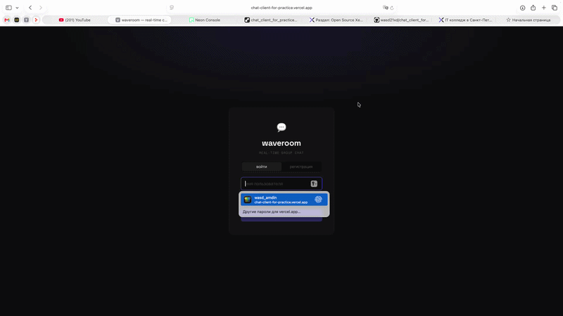

# waveroom 💬

Чат-приложение в реальном времени. Несколько пользователей подключаются к общей комнате и обмениваются сообщениями без перезагрузки страницы.

Проект выбран из каталога: https://github.com/practical-tutorials/project-based-learning  
Туториал: https://www.freecodecamp.org/news/how-to-build-a-chat-application-using-react-redux-redux-saga-and-web-sockets-47423e4bc21a

## Демо

## Что реализовано

- Ввод имени перед входом в чат
- Real-time обмен сообщениями через WebSocket
- Список активных пользователей в сайдбаре (обновляется при подключении/отключении)
- Системные сообщения о входе и выходе участников
- Сообщения отправителя отображаются справа, остальных — слева
- Уникальный цвет у каждого пользователя

## Стек

| Часть | Технология |
|---|---|
| Frontend | React 18, Redux 4, Redux-Saga |
| Транспорт | WebSocket (браузерный API + библиотека `ws`) |
| Backend | Node.js |
| Деплой клиента | Vercel |
| Деплой сервера | Render |

## Ссылки

- **Деплой (клиент):** https://chat-client-for-practice.vercel.app
- **Сервер (WebSocket):** https://chat-client-for-practice.onrender.com

## Code Climate

